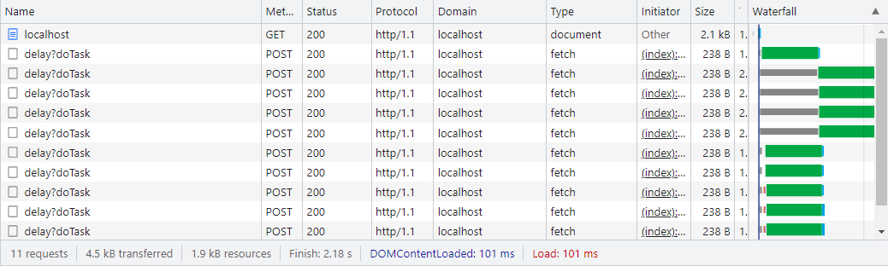

Same origin policyか何かで同一オリジンへのHTTP 1.1の同時接続数が制限される挙動についての調査。(fetch,XMLHttpRequest出もかかることを確認する)


### Environment

```
$ node -v
v16.17.0
```

手順
--------------

### 起動

```
npm install 
node index.js
```

### 確認


- アプリを起動する
- ブラウザを起動し開発者コンソールを開く
- `https://localhost` にアクセス





メモ
--------------

### 気になる点

- Chrome v107.0.5304.107
  - 制限数は6リクエスト
  - しかし同一URLかつGETリクエストの場合、1リクエストになる（Edge v108.0.1462.46 はこのような制限はなかった）
